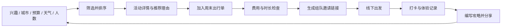

# 出门吗 · 周末城市探索指南

一个面向大学生的可交互中文产品原型：按兴趣、天气情景、人均预算与同行人数发现周末活动，串联组队邀请、打卡与攻略分享。

[在线体验](https://chumenma-weekend-xuan-0915.yangchegan.chatgpt.site) · [艺术感与现代感：前端参考及改版方向](docs/design-references.md)

## 产品结构

| 页面 | 解决的问题 | 可以完成的操作 |
| --- | --- | --- |
| 探索周末 | 信息分散、难以决定去哪玩 | 切换城市与日期、兴趣筛选、预算筛选、天气适配、搜索排序、查看详情、收藏、拼出行单 |
| 搭子广场 | 想去但没人陪，不好约时间 | 参考组队灵感、创建计划、填写集合时间地点、生成邀请链接 |
| 灵感攻略 | 行前没有经验，游后难以沉淀 | 阅读示例攻略、编写自己的路线与建议、分享可直接阅读的链接 |
| 我的足迹 | 想去的地方和游玩体验容易遗忘 | 收藏列表、日期和星级打卡、撤销打卡、将体验写成攻略 |

## 核心闭环



## 推荐逻辑

1. **硬条件筛选**：城市一致；单项预估花费不超过人均预算；符合选中的兴趣和搜索词。
2. **软条件排序**：晴天优先户外；雨天和高温显著提高室内活动优先级；适配计划人数的活动获得更高排序；一个人出行时偏向安静的小规模活动。
3. **可解释推荐**：直接展示“雨天优先”“不用花钱”“更适合小队”等理由。预算与时间依据显示在活动和出行单中。
4. **行程检查**：活动总价超过预算时提示；总活动时长超过 6 小时时建议拆分；一份计划仅包含同城活动，最多 6 项。

这是使用 AI Coding 工具开发的产品，当前推荐算法为可解释的本地规则，没有调用大模型或声称有实时 AI 服务。

## 当前数据边界

- 包含上海、杭州、成都共 18 个活动灵感；展览、市集、演出是示例规划，不是实时场次或可购票商品。
- 天气为可切换的演示情景，并非实时天气预报；日期按当前周末生成。
- 预算为示例估算，不含往返交通和餐饮，实际开放、预约、票价需向场所核实。
- 收藏、打卡、攻略与出行计划保存在当前浏览器的 `localStorage`。清除浏览器数据后会丢失，没有云端账户或跨设备同步。
- 组队邀请与攻略全文被编码到 URL fragment 中，朋友可直接打开并保存副本；人数是计划人数，没有后台报名、实时成员同步或聊天。
- 图片随站点静态部署。上海图为城市风景，展览和林间步道图为类别示意，均非具体活动现场实拍。

## 技术架构

```text
dist/index.html       页面入口、导航、弹窗、元信息
dist/styles.css       统一视觉、响应式布局、无障碍焦点
dist/app.js           活动数据、规则推荐、界面渲染、状态和分享
dist/images/          随站点部署的本地图片
scripts/serve.mjs     零依赖本地静态服务器
.openai/hosting.json  固定站点身份与静态部署目录
```

原生 HTML / CSS / JavaScript，零构建、零安装依赖。状态采用“活动数据 → 条件筛选 → 推荐排序 → 页面渲染”的单向流程，用户生成文本进行 HTML 转义，分享参数经过类型和活动 ID 校验。原生 `dialog` 支持键盘关闭，重要表单具有标签与必填约束。

### 本地运行

```bash
npm run dev
```

打开终端显示的本地地址。语法检查：`npm run check`。`dist/` 可直接发布为静态站点。

### 后续扩展方向

真实运营时可将活动目录和用户状态迁移到数据库，接入天气预报与官方活动来源；在组队模块增加登录、报名容量与成员同步。保留当前界面与数据模型边界，无需重做用户流程。部署更新始终复用同一个站点及域名。

## 图片来源

- 上海城市风光：[Night Glow / Unsplash](https://unsplash.com/photos/uvnMzTq2YeI)
- 展览空间：[Dannie Jing / Unsplash](https://unsplash.com/photos/3GZlhROZIQg)
- 林间步道：[Niki Clark / Unsplash](https://unsplash.com/photos/X7u11c5-c5Q)
- 使用许可：[Unsplash License](https://unsplash.com/license)
